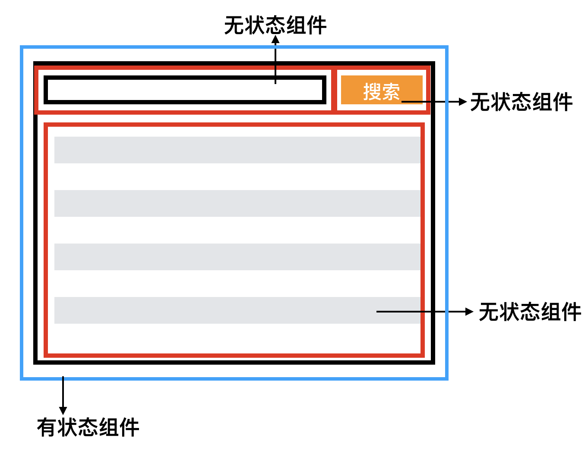
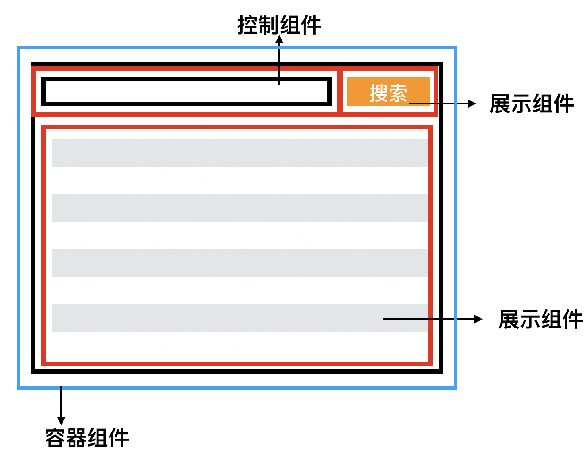

<!--
 * @Author: your name
 * @Date: 2020-06-30 14:39:32
 * @LastEditTime: 2020-07-15 15:28:08
 * @LastEditors: 李淳
 * @Description: In User Settings Edit
 * @FilePath: /cosmos/docs/cosmos/common.md
-->

# 公共管理

> @魏延、@何波

## 一、组件

### 1 封装原则

组件特征：
*可组合；*
*可重用；*
*可维护；*
- **单一原则**
易于编码、重用、测试及维护，将多个组件组合创建功能更强大的组件是react官方所推荐的，组合是react核心；关键做到一个组件只做一件事；

- **松耦合**
组件内的内容是紧密相关的。该内容可以是展示内容结构的，逻辑处理相关的，也可以是css样式部分；组件间的依赖关系要弱化，简洁，每个组件要尽量独立，一个组件不应该掌握其他组件的细节；
1. 组件更容易被替换或删除，而不影响其余组件；
2. 组件内部的修改不会影响其他组件，可维护性强；
3. 易测试性好，复用度高；

- **封装**
内部结构隐藏，组件之间只通过props来控制组件行为，组件内部的实现不应该被其余组件知道或者关联，父组件对子组件的控制通过props，而不是操作DOM或者使用ref；

- **扁平化数据**
在props被频繁update的情况下，如果存在嵌套数据，那么组件可能会被频繁render，性能也会因此而受到影响，其次是嵌套层级较深的数据操作不方便，易出错，写法不够优雅；

- **及时模块化**
1. 可复用度高吗？有些组件可能只适用于某个特定的地方，那么可能将其嵌入页面中可能更好点；
2. 是否有一个明确的理由？在分割代码时，应该考虑这是否允许拆解成更松散的耦合？有没有打破了一个逻辑上有意义的独立实体？这样拆解是否复用度更高，如果不能很清除的回答这个问题，那最好先不要进行组件抽离。
3. 收益是否超过成本？抽离封装组件不可避免的需要大量的时间和精力，其数量更具具体情况而变化，并且最终做出此决定时会有许多的因素。可能我们会过分关注组件化后的优势，而忽略了实现过程的成本，所以在做此决定时我们需要权衡这两方面。

### 2 组件分类

#### 2.1 纯组件和非纯组件（有无副作用）

**纯**的概念是出自函数式编程，指的是对**于一个函数而言，给定相同的输入，总能得到相同的输出，过程无副作用。**对应到组件中，props无变化，组件的输出总能保持一致；纯组件对于react的性能优化有重要意义，如果一个组件是一个纯组件，那么输入未变，组件无需重新渲染，这样带来的好处是，组件树越庞大所带来的的性能优化收益也就越高。
对于复杂的的页面，我们可以使用状态管理（redux,mobx）来维护组件状态树，然后将局部状态注入到子组件中，实现视图和逻辑分离的原则，来保持组件树的纯净性。

#### 2.2 有状态组件和无状态组件（有无状态管理）


有状态组件需要维护管理数据状态：

```jsx
const Page = () => {
  const [searchData, setSearchData] = useState(null);
  const [list, setList] = useState([]);
  ...
  return (
    <div>
      <Button onClick={handleClick}>搜索</Button>
      <Input onChange={inputChange} />
      <TableList list={list}>
    </div>
  );
}
```

无状态组件，以函数式组件的方式展现，在开发中尽量用这种形式

```jsx
const Title = ({title}) => {
  return <div>{title}</div>;
}
```

开发中建议状态集中统一维护管理，以依赖注入的形式将状态传入无状态组件（负责展示）；

#### 2.3 容器组件与展示组件（职能划分）


容器组件主要是关注业务处理，一般是从外部数据源获取数据，业务逻辑处理，然后组合展示组件来构建完整的视图；

```jsx
const Page = () => {
  const [searchData, setSearchData] = useState(null);
  const [list, setList] = useState([]);
  ...
  return (
    <div>
      <Button onClick={handleClick}>搜索</Button>
      <Input onChange={inputChange} />
      <TableList list={list}>
    </div>
  );
}
```

展示组件应该是一个只关注展示的组件，可被多处复用，不应该耦合任何业务逻辑，Antd组件库就是展示组件；

```jsx
const Title = ({title}) => {
  return <div>{title}</div>;
}
```

|       |     容器组件     |    展示组件   |
|:------|:---------------:|:-----------:|
| 关注点 |    业务逻辑处理   |  UI视图展示   |
| 数据源 |  状态管理/后端接口 |    props    |

从可复用性和可维护性来看，容器组件和展示组件分离有助于更好的逻辑和UI的分离，展示组件可以更好的被复用，展示组件更轻量更容易被测试；

**容器组件 or 展示组件**

> 我建议你做 app 的时候优先使用展示组件。当你意识到，有一些中间组件传递了过多的 props，有一些组件并不使用它们继承的 props 而只是将这些 props 传递给他们的子级，而且每次子级组件需要更多数据时，你都需要重新调整或编写这些中间组件，那么，这时候你可以考虑引入容器组件了。这样做，你可以传递 props 和方法给末端的子级组件，而不必麻烦一些不相关的中间组件。
--Dan Abramov

容器组件和展示组件的分离本质是逻辑和视图的分离。在HOOK出现后，容器组件内部的逻辑处理一般可以被HOOK形式取代;

### 二、HOOK

react官方已阐述了hook的**动机**：

1. 很难在组件之间复用状态逻辑：
无论是高阶组件还是render props都是设计层面的，react官方从未在本身的框架层面提供一种将可复用的逻辑注入到组件上的方式；
此前高阶组件和render props都是基于组件本身的机制，有一定的缺点

- 易造成多余的节点嵌套
- HOC比较复杂，难以理解
HOOK解决方式：
- 将状态逻辑从组件中脱离，可被单独测试及复用
- HOOK可在组件之间共享，不影响组件的结构

2. 复杂的组件难以理解：
复杂组件的特点是有一大堆分散的状态逻辑和副作用， 例如每个生命周期函数常常包含一些互不相关的逻辑，这些互不相关的逻辑很难再对它们进行拆解;
之前的做法一般是：分割逻辑和UI，切割成更小粒度的组件;
HOOK解决方式：HOOK允许将一个组件分割成更小的函数，而不是基于生命周期划分；

3. 难以理解的Class
HOOK更函数，HOOK 使你在非 class 的情况下可以使用更多的 React 特性，不需要理解this；

#### 自定义HOOK的场景

**Hook 是一种复用逻辑片段的方式，我们把可复用的状态逻辑抽离到一个函数中作为自定义Hook，通过多个Hook的组合完成复杂逻辑共享**

和组件化思维不同，这是另外一个粒度更细的代码复用思维。处理获取数据过程中的公用逻辑，处理公用的登陆逻辑等。自定义HOOK封装的大多数情况下不是一个完整的页面逻辑实现，而是其中的一个片段。
原则上来说，公共逻辑片段无论是在业务场景中，还是在工具模块中，都非常多。而HOOK 能够轻松解决在React环境中的逻辑片段封装。这是自定义HOOK的底层思维。
理解了这个思维，我们能够容易的辨别出来，哪些场景需要使用自定义HOOK。也能够感受得到，在大型项目中，自定义HOOK对于大型项目的重要性。

- 副作用封装和监听，useSize(监听浏览器窗口大小)，useOnline(监听在线状态)
- 副作用衍生，useDebounce,useThrottle
- DOM事件封装，useFocus,useActive
- 封装可复用逻辑和状态，useRequest(异步请求)，useTablelist(列表加载)等
- 其他

### 三、目录管理

```
src
├─ components                       #全局通用的UI组件
|     ├─ Button                     #组件推荐使用目录形式，方便后期扩展
|     |     └─ index.tsx
|     ├─Loading
|     |     ├─ index.tsx
|          ...
├─ pages                            #包含'容器组件'和'页面组件'
|    ├─ LoginPage                   #登录页面 
|    |    ├─ components             #页面级别组件，该类组件不能复用
|    |    |     └─ LoginForm
|    |    |          ├─ index.tsx  
|    |    ├─ const.ts               #声明的常量文件
|    |    ├─ index.tsx              #页面入口文件
|    ├─ HomePage 
|          ...
├─ hooks                            #自定义公共hooks
|    └─ useRequest
|         ├─ index.ts
|         ├─ types.ts
|          ...
```
### 四、代码规范

#### 1 组件规范

##### 1.1 基础规范

- 建议组件使用文件夹目录形式，方便后期扩展
- 一个文件/文件夹目录 只声明一个组件： 尽管可以在一个文件中声明多个 React 组件，但是最好不要这样做；推荐一个文件声明一个 React 组件，并只导出一个组件；
- 优先使用FC类型声明函数组件

```jsx
import React, { FC } from 'react';

/**
 * 声明Props类型
 */
interface MyComponentProps {
  className?: string;
  style?: React.CSSProperties;
}

const MyComponent: FC<MyComponentProps> = props => {
  return <div>hello react</div>;
};
```

- 默认props声明

```jsx
interface HelloProps {
  name?: string; // 声明为可选属性
}

// 利用对象默认属性值语法
const Hello: FC<HelloProps> = ({ name = 'react' }) => <div>Hello {name}!</div>;
```

- 尽可能少用扩展运算符传递属性，只有在清楚明白扩展对象时才使用扩展运算符，传递属性时尽可能筛选出不必要的属性

```jsx
//BAD
const { irrelevantProp, ...relevantProps } = state;
return <MyComponent { ...state } />

//GOOD
const { irrelevantProp, ...relevantProps } = state;
return <MyComponent { ...relevantProps } />
```

##### 1.2 命名规范
- 组件名为PascalCase(大驼峰命名)，组件内部属性使用小驼峰命名属性。

```jsx
// 组件名称
MyComponent
// 属性名称
handleClick
```

- 组件名称与文件名称保持相同，同时组件名称应当能体现出组件的功能，以便通过观察文件名即确定使用哪一个组件。
- 使用 onXxx 形式作为 props 中用于回调的属性名称，使用统一的命名规则用以区分 props 中回调和非回调部分的属性。 对于不用于回调的函数类型的属性，使用动词作为属性名称。

```jsx
// onClick作为回调以on开头，renderText非回调函数则使用动词
let Label = ({onClick, renderText}) => <span onClick={onClick}>{renderText()}</span>;
```

##### 1.3 组件声明

- 不要使用displayName来命名组件，通过引用来命名。 

```jsx
// BAD
export default () => <div>...</div>

// GOOD
const Home = () => (
  <div>...</div>
);
export default Home;
```

##### 1.4 组件实现

- 除某些特定组件（顶层组件、路由级组件等）以外，所有公共组件均在概念上实现为纯组件（概念在上面已讲述）；

```jsx
// BAD
const RandomNumber = () => <span>{Math.random()}</span>;
const Clock = () => <span>{Date.time()}</span>;
// GOOD
const RandomNumber = (props) => <span>{props.randomNumber}</span>;
const Clock = (props) => <span>{props.nowDate}</span>;
```

如果需要在组件树的某个节点使用随机数、日期等非纯的数据，应当由顶层组件生成这个值并通过props传递下来。对于使用Redux等应用状态管理的系统，可以在应用状态中存放相关值。
- props数据层级不能嵌套过深，props应尽可能扁平化

```jsx
// BAD
const MyBox = (props) => (
const { variant: { height, width }, title } = props;
  <div style={{ width: `${width}px`, height: `${height}px` }}>{title}</div>
);
// GOOD
const MyBox = ({ height, width, title }) => (
  <div style={{ width: `${width}px`, height: `${height}px` }}>{title}</div>
);
```

#### 2 HOOK规范

##### 2.1 在顶层调用HOOK

不要在循环，条件，或者内嵌函数中调用，这些主要是为了保证每次render的时候会安照相同的顺序执行HOOK，这也是能够让React在多个useState和useEffect执行中正确保存数据的原因

##### 2.2 在React函数中调用HOOK

- 只在React函数组件中调用
- 不要在普通的JS函数中调用HOOK
- 自定义HOOK中调用
可以确保你源码中组件的所有有状态逻辑都是清晰可见的

```jsx
const Form = () => {
 const [name, setName] = useState('Mary');
 useEffect(function persistForm() {
   localStorage.setItem('formData', name);
 });

 const [surname, setSurname] = useState('Poppins');
 useEffect(function updateTitle() {
   document.title = name + ' ' + surname;
 });
 // ...
}
```

那么 React 怎么知道哪个 state 对应哪个 useState？答案是 React 靠的是 Hook 调用的顺序。因为我们的示例中，HOOK 的调用顺序在每次渲染中都是相同的，所以它能够正常工作：

```jsx
// 首次渲染
useState('Mary')   // 1. 使用'Mary'初始化变量名为name的state
useEffect(persistForm) // 2. 添加effect以保存form操作
useState('Poppins') // 3. 使用'Poppins'初始化变量名为surname的state
useEffect(updateTitle) // 4. 添加effect以更新标题

// 二次渲染
useState('Mary')     // 1. 读取变量名为name的state
useEffect(persistForm) // 2. 替换保存form的effect
useState('Poppins') // 3. 读取变量名为surname的state
useEffect(updateTitle) // 4. 替换更新标题的effect
```

只要 Hook 的调用顺序在多次渲染之间保持一致，React 就能正确地将内部 state 和对应的 Hook 进行关联。这就是为什么 HOOK 需要在我们组件的最顶层调用。如果我们想要有条件地执行一个 effect，可以将判断放到 HOOK 的内部：

```jsx
useEffect(function persistForm() {
    // 将条件判断放置在 effect 中
    if (name !== '') {
      localStorage.setItem('formData', name);
    }
});
```

##### 2.3 自定义HOOK必须以use开头

自定义HOOK，可以将组件逻辑片段提取到可重用的函数中，来解决逻辑片段难以复用问题

```jsx
const useWidth = (defaultWidth) => {
 const [width,setWidth]=useState(document.body.clientWidth);
 const onChange = useCallback (() => {
    setWidth(document.body.clientWidth);
  }, []);
  useEffect(() => {
    window.addEventListener('resize', onChange, false);
    return () => {
      window.removeEventListener('resize', onChange, false);
    }
  }, [onChange]);
  return width;
}

const App = () => {
  const width = useWidth(document.body.clientWidth);
  return (
    <div>
      页面宽度: { width }
    </div>
    )
}
```

函数内部可以调用其他的HOOK，至于为什么要以use开头，是因为如果不以use开头，react就无法判断某个函数是否包含对其内部HOOK的调用，react也将无法自动检查你的HOOK是否违反了HOOK的规则，所以要以use开头 。
