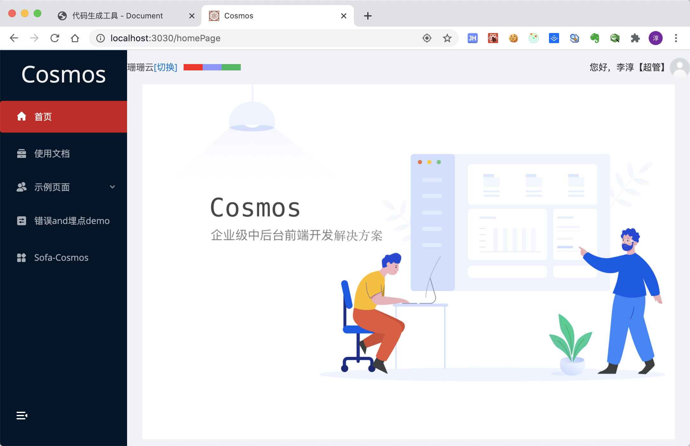

<!--
 * @Author: your name
 * @Date: 2020-06-30 14:27:48
 * @LastEditTime: 2020-07-22 15:31:36
 * @LastEditors: 李淳
 * @Description: In User Settings Edit
 * @FilePath: /cosmos/docs/cosmos/start.md
-->

# 开始使用

## 前序准备

你的本地环境需要安装node、npm、git。我们的技术栈基于ES2015+、React、Typescript和Antd。基础脚手架工具使用的是自研工具sofa，因此第一步需要全局安装sofa-scripts。

## sofa安装

确定内网VPN连接，npm指向内部源。

```shell
# 查看源
npm config get registry
# 确定为：http://10.188.40.249/

npm install -g sofa-scripts

# 在安装过程中使用默认数据库秘钥即可。
# 安装完毕后，可运行此ls命令检查安装及数据库连接情况。
# 注意：需要连接内网VPN
sofa ls

# 查看全部命令
sofa --help
```

## 初始化新项目

```shell
# 获取最新版本cosmos
sofa cosmos [projectName]

# sofa的每次执行都会进行日志记录
```

## 编辑器

推荐VScode；项目内置了部分VSCode的推荐插件，望安装；

### fileheader插件

fileheader插件使用的是"obkoro1.korofileheader"，需要自行进行配置姓名字段，请关注。

## 开发

### 启动项目

```shell
# 安装依赖
npm install
# 注意：项目依赖部分内源npm包，因此内置了内源npm设置文件.npmrc，直接运行install命令即可；

npm run start
```

安装完成后启动开发模式，完毕后打开 http://localhost:3030 你看到下面的页面就代表成功了。



### 常用命令

| 指令                    | 功能                           |
| -------------          | ------------------------------|
| npm run install   | 安装依赖                             |
| npm run start   | 启动项目                               |
| npm run build   | 打包                                  |
| npm run deploy xx | 部署到机器xx，新增机器需在/src/configs/dev.deploy.conf中添加机器及对应文件地址 |
| npm run generate  | 快速生成component、container、translation 文件 |
| npm run cm  | 进行git commit |
| npm run new-page  | 使用sofa进行快速页面创建 |
| npm run new-component  | 使用sofa进行快速组件创建 |
| npm run docs  | 查看本项目文档，详细使用见[项目文档管理](/introduce/start?id=项目文档管理) |
| npm run docs:cosmos  | 查看cosmos框架文档 |

### Mock数据

1. 内网搭建Easy Mock，服务地址是http://easy-mock.sftcwl.com；
2. 创建账号并登陆，创建项目后进入项目创建接口；
3. 复制项目base url，在src/configs/dev.proxy.config.js文件中使用常量命名添加base url代理地址，e.g. const mockServer = 'http://easy-mock.sftcwl.com/mock/5ebc25690e1f322cd339b684'；
4. module.exports模块导出中新增接口-代理环境映射匹配规则，e.g.'/user': mockServer；
5. npm run start启动项目即可使用app.use()顺序执行匹配规则；

## 项目文档管理

项目文档及Cosmos框架文档均使用的**docsify**，因此需要全局安装docsify。

### docsify使用

| 指令                    | 功能                                  |
| -------------          | -------------------------------------|
| npm i docsify-cli -g   | 安装依赖                               |
| docsify serve docs     | 启动docs,实时预览                       |
| docsify serve docs -p port | 启动docs指定端口 `localhost:port `  |

### 文档维护说明

- 新增维护记录，在`/docs/changeLog`中添加维护记录文件，命名`logMMDD`，在`/docs/changeLog/logMMDD`文件中简述此次维护内容，需要时附上对应docsify文档说明文件目录进行快速跳转定位；
- 新增项目说明，在`/docs/project/xxx`中添加新增说明文件，详细描述对应功能和使用；
- 新增说明和维护记录均需在`_sidebar.md`中增加对应目录；
